# PDIWS: Thermal Imaging Dataset for Person Detection in Intrusion Warning Systems
[The PDIWS dataset is available here](https://drive.google.com/drive/folders/1mKGz5UIfmyfZUR8PU6u9HgQ33Dd7dqsn?usp=share_link). Please refer to our paper for more details: https://ieeexplore.ieee.org/document/10208055 or https://arxiv.org/abs/2302.13293 (preprint).

## Installation
### Clone this repo or download source code
```
git clone https://github.com/thuan-researcher/Intruder-Thermal-Dataset.git
```
### Install requirement packages
``` 
pip install requirements.txt
```

## Data
### Data description
Each image in the dataset is compounded by an object image and a background using the Poison image editing method (see `./PIE`).
The dataset folder `./dataset` consists of two subsets `train` and `test`:
- `train`: 2,000 images under `.JPG` format, each image contains only one object.
- `test`: 500 images under `.JPG` format, each image contains only one object.

Labels for those images are stored in files `train.json` and `test.json`. Each contains a list of annotation directories following the format: 
```
{"image_id": i, "bbox": [x, y, w, h], "class": c}
```
where i is the image index (file name), bbox is the bounding box, class (0-4) is the type of position (0: creeping, 1: crawling, 2: stooping, 3: climbing, 4: other).

### Example data
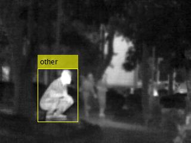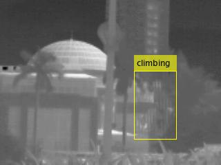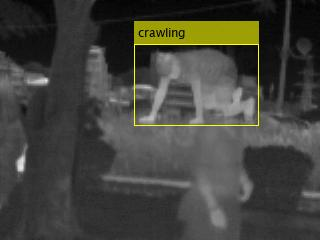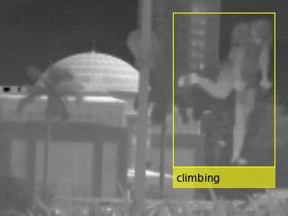

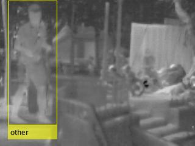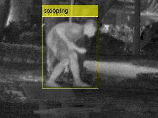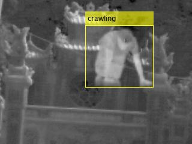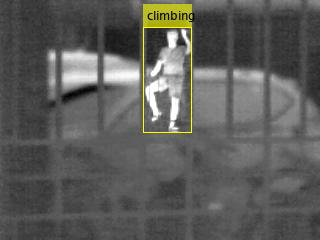

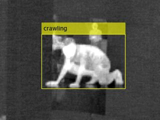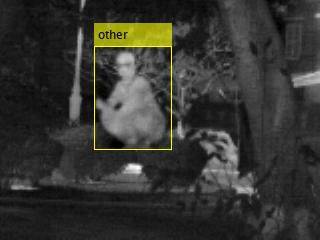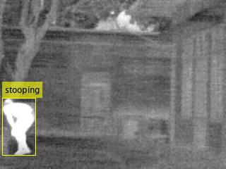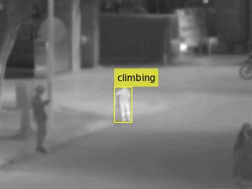

## Training and test
``` 
python3 train.py
```
